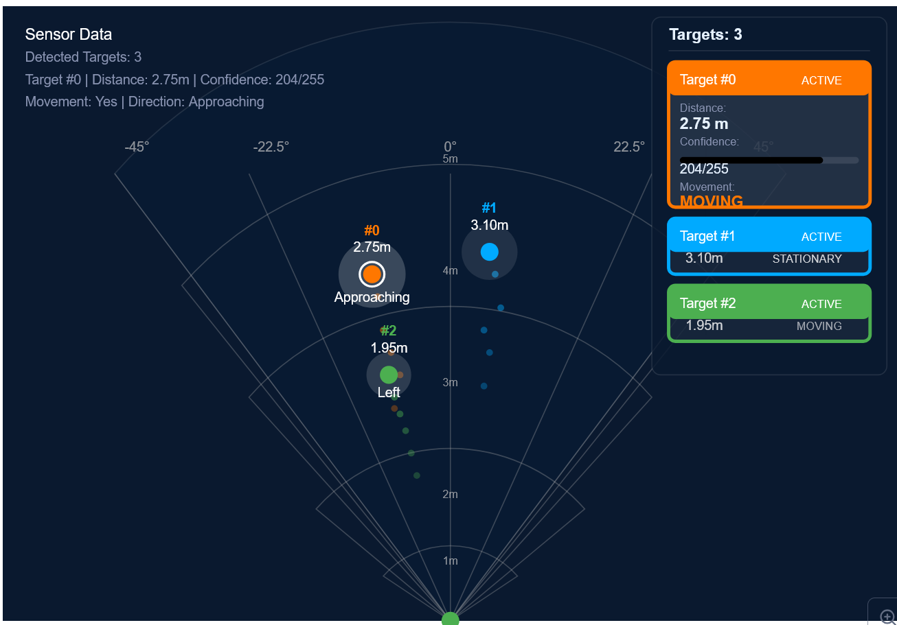

<div align="center">
  <h1>Presence Detection System</h1>
  <p>
    
    
    
    
    
    
  </p>
  <p>A Simple IoT Project for presence detection using mmWave radar technology, using MQTT, plus a cross-platform desktop application.</p>
</div>

## 📋 Overview

This project consists of two main components:
1. **IoT Device**: ESP32-C6 based hardware with DFRobot SEN0395 mmWave radar sensor
2. **Desktop Application**: Cross-platform application built with Tauri, Svelte, TypeScript, and Tailwind CSS


## 🔧 Technology Choices

This project leverages a carefully selected technology stack to provide an optimal balance of performance, developer experience, and cross-platform compatibility.

### Why Tauri + Rust

- **Incredibly Light Footprint**: Tauri applications are significantly smaller than Electron alternatives (3-10MB vs 100MB+), resulting in faster downloads, updates, and less resource usage.
- **Enhanced Security**: Rust's memory safety guarantees provide robust security without runtime overhead.
- **Performance Efficiency**: Rust's low-level control and zero-cost abstractions make it well-suited for processing real-time sensor data streams without introducing latency or performance bottlenecks.
- **Cross-Platform Compatibility**: Build once and deploy across Windows, macOS, Linux, and mobile with native look and feel, dramatically reducing maintenance overhead.

### Why Svelte + TypeScript

- **Reactive by Design**: Svelte's built-in reactivity system is ideal for displaying continuously updating sensor data with minimal code and maximum performance.
- **Reduced Bundle Size**: Unlike traditional frameworks that ship their entire runtime to the browser, Svelte compiles components into highly optimized vanilla JavaScript at build time. This "disappearing framework" approach eliminates runtime overhead and results in significantly smaller bundles, perfectly complementing Tauri's lightweight philosophy.
- **Type Safety**: TypeScript provides compile-time error checking, better IDE support, and self-documenting code through its type system. This reduces runtime errors and simplifies maintenance, particularly valuable when multiple developers collaborate on a complex codebase.
- **Developer Experience**: Svelte's straightforward, declarative approach to building UIs reduces development time and makes maintenance more intuitive.

### MQTT for Connectivity

The project uses MQTT for device-to-application communication, offering several advantages:

- **Lightweight Protocol**: Designed for constrained devices and low-bandwidth, high-latency networks—perfect for IoT applications.
- **Publish/Subscribe Pattern**: Enables flexible data distribution with minimal network overhead.
- **Quality of Service Options**: Configurable message delivery guarantees ensure critical presence data is never lost.
- **Widespread Support**: Robust client libraries and broker implementations across platforms.

The desktop application leverages the operating system's native networking capabilities for WiFi connectivity, simplifying setup and improving reliability across platforms.

### Tailwind CSS for UI

- **Utility-First Approach**: Enables rapid UI development without leaving your HTML/Svelte files.
- **Consistent Design System**: Provides a cohesive look and feel across the entire application.
- **Minimal CSS Overhead**: Only includes the styles you actually use, keeping the application lightweight.

Together, this technology stack delivers a responsive, efficient, and secure application capable of handling complex real-time sensor data while providing an intuitive and pleasant user experience.


## 📡 IoT Device

### Hardware Components

<table>
  <tr>
    <td><b>Microcontroller</b></td>
    <td>ESP32-C6 (featuring Wi-Fi 6, Bluetooth 5.0 LE, Zigbee 3.0, and Thread 1.3)</td>
  </tr>
  <tr>
    <td><b>Sensor</b></td>
    <td>DFRobot SEN0395 24GHz mmWave radar sensor</td>
  </tr>
  <tr>
    <td><b>Power</b></td>
    <td>3.6-5V DC input (USB-C connector)</td>
  </tr>
  <tr>
    <td><b>Connectivity</b></td>
    <td>Multiple protocols (Wi-Fi, BLE, Zigbee, Thread)</td>
  </tr>
  <tr>
    <td><b>Optional</b></td>
    <td>RGB LED for status indication, additional GPIO connections for external triggers</td>
  </tr>
</table>

### Features

- ✅ Non-intrusive presence detection using mmWave radar technology (detects both stationary and moving humans)
- ✅ Multi-target tracking with precise distance, angle, and movement information
- ✅ Accurate detection even for sleeping persons or minimal movement
- ✅ Up to 9m detection range with 100°×40° beam angle
- ✅ Configurable detection zones and parameters via serial interface
- ✅ Confidence level reporting for detection reliability assessment
- ✅ Movement direction determination (approaching, receding, lateral movement)
- ✅ Low power consumption (90mA typical operating current)
- ✅ Strong anti-interference ability against environmental factors (temperature, humidity, dust, light, etc.)
- ✅ LED status indicators for easy troubleshooting

### Setup Instructions

1. **Hardware Assembly**
   - Connect the SEN0395 mmWave radar sensor to the ESP32-C6 board:
     - VCC → 3.3V or 5V (3.3V recommended)
     - GND → GND
     - UART Tx → GPIO17 (RX pin on ESP32-C6)
     - UART Rx → GPIO16 (TX pin on ESP32-C6)
     - GPIO2 → GPIO6 (for direct presence detection output)
   - Position the sensor following recommended mounting guidelines (top, underneath, or horizontal installation)
   - Power the device using a USB-C cable

2. **Firmware Installation**
   - Clone this repository
   - Open the Arduino IDE
   - Install ESP32-C6 board support:
     - Go to File → Preferences
     - Add this URL to the "Additional Boards Manager URLs": https://raw.githubusercontent.com/espressif/arduino-esp32/gh-pages/package_esp32_index.json
     - Go to Tools → Board → Boards Manager
     - Search for "esp32" and install the latest version
   - Select the appropriate board: Tools → Board → ESP32 Arduino → ESP32-C6 Dev Module
   - Open the firmware sketch from the `/firmware/presence_detection` directory
   - Install required libraries via Library Manager (Tools → Manage Libraries)
   - Connect your ESP32-C6 board via USB
   - Select the correct port under Tools → Port
   - Click Upload button to flash the firmware

3. **Sensor Configuration**
   - The default configuration supports basic presence detection
   - For advanced configuration:
     - Use serial commands to adjust detection range (0-9m)
     - Configure output delay parameters
     - Set up multiple detection zones if needed
   - Use the desktop application to manage device settings or send direct UART commands at 115200 baud

### Technical Specifications

<details>
<summary><b>ESP32-C6 Microcontroller</b></summary>

- **Wi-Fi**: 2.4 GHz Wi-Fi 6 (802.11ax)
- **Bluetooth**: Bluetooth 5.0 LE
- **Other Protocols**: Zigbee 3.0, Thread 1.3 (IEEE 802.15.4)
- **Flash Memory**: 8MB SPI flash
- **Operating Voltage**: 3.3V (with onboard 5V to 3.3V LDO)
- **USB Interface**: USB 2.0 full-speed (12 Mbps)
</details>

<details>
<summary><b>mmWave Radar Sensor (SEN0395)</b></summary>

- **Technology**: FMCW (Frequency Modulated Continuous Wave) radar
- **Frequency**: 24GHz millimeter-wave
- **Detection Range**: Up to 9 meters
- **Detection Angle**: 100° horizontal, 40° vertical
- **Power Consumption**: 90mA operating, can be optimized with configurable parameters
- **Operating Voltage**: 3.6-5V
- **Communication**: Serial UART (115200 baud) and GPIO outputs
- **Firmware Updates**: Serial port configuration and updates supported
- **Operating Temperature**: -40~85℃
</details>


## 💻 Desktop Application

### Features

- Real-time presence detection visualization with radar display
- Multi-target tracking with distance, angle, and movement direction
- Confidence level monitoring and display

### Visualization Interface

<p align="center">
  
</p>

The application features an advanced radar-style visualization that displays:

- **Multiple Target Tracking**: Detect and track up to several individuals simultaneously
- **Spatial Mapping**: View targets on a polar coordinate system with distance rings
- **Movement Analysis**: See direction of movement (approaching, receding, left, right)
- **Detailed Metrics**:
  - Precise distance measurements (accuracy to 0.01m)
  - Confidence levels (0-255 scale)
  - Movement status (moving or stationary)
  - Target IDs for consistent tracking
- **Real-time Updates**: Continuous data refresh from the mmWave sensor

### Installation

#### TODO


### Key Application Features

#### 1. Dashboard
- At-a-glance system status
- Real-time occupancy information

#### 2. Radar View
- Interactive radar visualization as shown above
- Adjustable view parameters (range, scale, refresh rate)
- Historical trail visualization for movement patterns
- Filtering options (by distance, confidence, movement)

#### 4. Device Management
- MQTT management
- Sensor parameter adjustment


### System Requirements

<table>
  <tr>
    <td><b>Windows</b></td>
    <td>Windows 10 or later</td>
  </tr>
  <tr>
    <td><b>macOS</b></td>
    <td><s>macOS 10.15 (Catalina) or later</s></td>
  </tr>
  <tr>
    <td><b>Linux</b></td>
    <td><s>Ubuntu 20.04 or equivalent</s></td>
  </tr>
  <tr>
    <td><b>Connectivity</b></td>
    <td>
      One of the following:<br>
      - Wi-Fi (2.4 GHz)<br>
      - <s>Bluetooth 5.0 compatible</s><br>
      - <s>Thread or Zigbee network (if using those protocols)</s>
    </td>
  </tr>
</table>

## 🛠️ Development

### Repository Structure

```
presence-detection/
├── firmware/                 # ESP32-C6 firmware code
│   ├── presence_detection/   # Main sketch
│   ├── libraries/            # Custom libraries
│   │   ├── mmWaveRadar/      # mmWave radar driver library
│   │   └── PresenceUtils/    # Utility functions
│   └── examples/             # Example sketches
├── app/                      # Desktop application
│   ├── src/                  # Svelte components and TypeScript code
│   ├── src-tauri/            # Tauri (Rust) backend code
│   ├── public/               # Static assets
│   └── build/                # Build output
├── hardware/                 # Hardware design files
│   ├── schematics/           # Circuit schematics
│   └── enclosure/            # 3D printable enclosure files
└── docs/                     # Documentation
```

### Build Requirements

<details>
<summary><b>Firmware</b></summary>

- Arduino IDE 2.0 or later
- ESP32 Arduino Core (using Boards Manager)
- Required libraries:
  - Arduino library for mmWave Radar SEN0395 
  - Arduino WiFi libraries (for WiFi connectivity)
  - Arduino MQTT libraries
</details>

<details>
<summary><b>Desktop Application</b></summary>

- Rust 1.65 or later
- pnpm
- Platform-specific build dependencies for Tauri:
  - **Windows**: Microsoft Visual Studio C++ Build Tools
  - ~~**macOS**: Xcode Command Line Tools~~
  - ~~**Linux**: `build-essential`, `libwebkit2gtk-4.0-dev`, `libssl-dev`, and other Tauri dependencies~~
</details>

### Communication Protocols

The system supports multiple communication methods:

1. **Serial Communication with mmWave Sensor**
   - UART at 115200 baud rate, 8 data bits, no parity, 1 stop bit
   - ASCII command strings format for configuration
   - Structured data output for presence detection results
   - Extended protocol for detailed target information (distance, angle, confidence, movement)
   - Details in the [mmWave sensor protocol documentation](./docs/protocol/mmwave_protocol.md)

2. **ESP32-C6 to Desktop Communication**
   - **Wi-Fi**: Leverage applications operating systems native WiFi solution for connectivity
   - **MQTT**: Protocol used to transmit data over WiFi connectivity.
   - **USB**: Serial communication for debugging and direct control
   - Real-time data streaming protocol for multi-target information
   - Full protocol specifications in the [communication documentation](./docs/protocol/README.md)

3. **Data Format**
   ```json
   {
     "targets": [
       {
         "id": 0,
         "distance": 2.75,
         "angle": -15.2,
         "confidence": 204,
         "movement": "approaching",
         "velocity": 0.3,
         "isActive": true
       },
       ...
     ]
   }
   ```

## 🏠 Use Cases

<div style="display: grid; grid-template-columns: repeat(2, 1fr); gap: 20px;">
<div>

### Smart Home
- Room presence detection for lighting and HVAC control
- Security monitoring with multi-person tracking
- Sleep monitoring without privacy concerns of cameras
- Energy optimization based on occupancy patterns
</div>

<div>

### Office Environments
- Meeting room utilization analytics
- Desk occupancy monitoring
- Traffic flow analysis for space optimization
- Triggering of presentation systems based on presence
</div>

<div>

### Retail and Public Spaces
- Customer flow analysis
- Queue management
- Occupancy counting with directional information
- Triggering of interactive displays when approached
</div>

<div>

### Industrial Applications
- Safety zone monitoring
- Process automation based on worker presence
- Equipment activation/deactivation based on proximity
- Unauthorized access detection
</div>
</div>

## 👥 Contributing

N/A

## 📄 License

This project is licensed under the MIT License - see the [LICENSE](./LICENSE) file for details.

## 🙏 Acknowledgments

- [DFRobot](https://www.dfrobot.com/) for the SEN0395 mmWave radar sensor
- [Espressif](https://www.espressif.com/) for the ESP32-C6 microcontroller and ESP-IDF framework
- [Tauri](https://tauri.app/) for the desktop application framework
- [Svelte](https://svelte.dev/) for the frontend framework
- [Tailwind CSS](https://tailwindcss.com/) for UI styling

## 📚 References

- [ESP32-C6 Technical Documentation](https://www.espressif.com/en/products/socs/esp32-c6)
- [DFRobot SEN0395 mmWave Radar Sensor Documentation](https://wiki.dfrobot.com/mmWave_Radar_Human_Presence_Detection_SKU_SEN0395)
- [ESP-IDF Programming Guide](https://docs.espressif.com/projects/esp-idf/en/latest/esp32c6/index.html)
